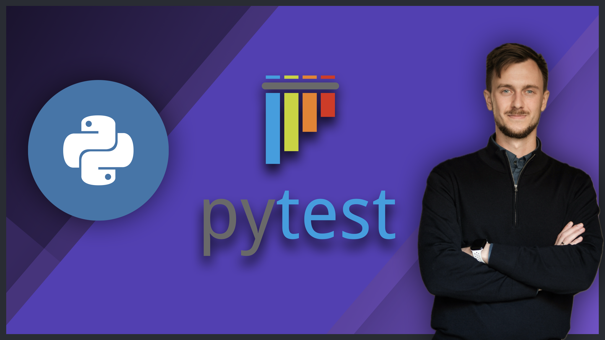

# [Pytest Course: Practical Testing of Real-World Python Code](https://www.udemy.com/course/pytest-course-python)

**Learn how to test real-world Python applications with pytest, from unit tests to full CI/CD automation.**

👉 **Enroll here:**  
**https://www.udemy.com/course/pytest-course-python**

---

## 🚀 Learn Pytest the Way It’s Used in Real Projects

This course is a **hands-on, practical guide to testing real-world Python code with pytest**.  
No toy examples. No artificial exercises. Just the patterns, tools, and workflows you’ll actually use as a Python developer.

If you’ve ever:
- felt unsure how to structure tests properly  
- struggled with fixtures, mocks, or parametrization  
- wanted confidence refactoring production code  
- or needed to introduce testing into an existing codebase  

👉 this course is built for you.

---

## 📚 Course Content

## Part 1: Introduction

- Introduction
- [Real World Example: New Scikit Feature](part1-introduction/real-world-example)
- [Real World Example: Why Testing](part1-introduction/real-world-example)
- [TDD & BDD: From Theory to Practice](part1-introduction/tdd-bdd)
- Virtual Environments & pytest Installation
- [Pytest: Run & Debug](part1-introduction/pytest-run-and-debug)
- [Test Execution Status](part1-introduction/test-execution-status)
- [Hands-On Practice: Order Processing](part1-introduction/practice-orders-processing)
- Module Summary

## Part 2: Diving Deeper into pytest

- Module Introduction
- [Writing Test Classes](part2-diving-deeper/document-editor)
- [Descriptive Test Failure](part2-diving-deeper/document-editor)
- [Asserting Exceptions](part2-diving-deeper/document-editor)
- [Given-When-Then Structure](part2-diving-deeper/document-editor)
- [Selective Tests Running](part2-diving-deeper/document-editor)
- [Challenge: more-itertools](part2-diving-deeper/challenge/task)
- [Challenge: Solution](part2-diving-deeper/challenge/solution)
- Module Summary

## Part 3: Fixtures

- Module Introduction
- What is @pytest.fixture
- [Setup and Teardown](part3-fixtures/setup-teardown)
- [Fixture Scope](part3-fixtures/fixture-scope)
- [Reusable Fixtures via conftest.py](part3-fixtures/user-analytics-api)
- [Temporary Directories & Output Capture](part3-fixtures/user-analytics-api)
- [Mocking with monkeypatch](part3-fixtures/user-analytics-api)
- [Fixtures with autouse](part3-fixtures/user-analytics-api)
- [Testing Logs](part3-fixtures/user-analytics-api)
- [Challenge: Finance Tracker](part3-fixtures/challenge)
- [Challenge: Solution](part3-fixtures/challenge)
- Module Summary

## Part 4: Parametrization

- Module Introduction
- [Problem: Almost Identical Tests](part4-parametrization/unit-converter)
- [Parametrizing Tests](part4-parametrization/unit-converter)
- [Parametrizing Fixtures](part4-parametrization/unit-converter)
- [Dynamic Parametrization](part4-parametrization/unit-converter)
- [Factories as Fixtures](part4-parametrization/unit-converter)
- [Finance Tracker: Parametrized Tests](part4-parametrization/challenge)
- Module Summary

## Part 5: Advanced pytest

- Module Introduction
- [Advanced Mocking](part5-advanced-pytest/pftracker)
- [Mocking with mocker](part5-advanced-pytest/pftracker)
- [Mocking Classes](part5-advanced-pytest/pftracker)
- [Mock Drift](part5-advanced-pytest/pftracker)
- [Patching Target](part5-advanced-pytest/patching)
- [Patching Decorators](part5-advanced-pytest/patching)
- [Markers](part5-advanced-pytest/pftracker)
- [Marker-Aware Fixture](part5-advanced-pytest/pftracker)
- [Configuration Files](part5-advanced-pytest/pftracker)
- [Coverage: Part 1](part5-advanced-pytest/shop)
- [Coverage: Part 2](part5-advanced-pytest/shop)
- [Hypothesis and Faker](part5-advanced-pytest/unit-converter)
- [Testing Levels](part5-advanced-pytest/testing-levels)
- [Testing Levels in Action](part5-advanced-pytest/testing-levels)
- [Test File Name Collision](part5-advanced-pytest/testing-levels)
- Module Summary

## Part 6: CI/CD Automation

- Module Introduction
- CI/CD Explained
- [CI with GitHub Actions: Part 1](part6-cicd-automation/unit-converter)
- [CI with GitHub Actions: Part 2](part6-cicd-automation/unit-converter)
- [Matrix Testing with pytest](part6-cicd-automation/unit-converter)
- [Parallel Testing & Coverage Gates](part6-cicd-automation/unit-converter)
- Module Summary

## Part 7: Bonus

- Course Roundup