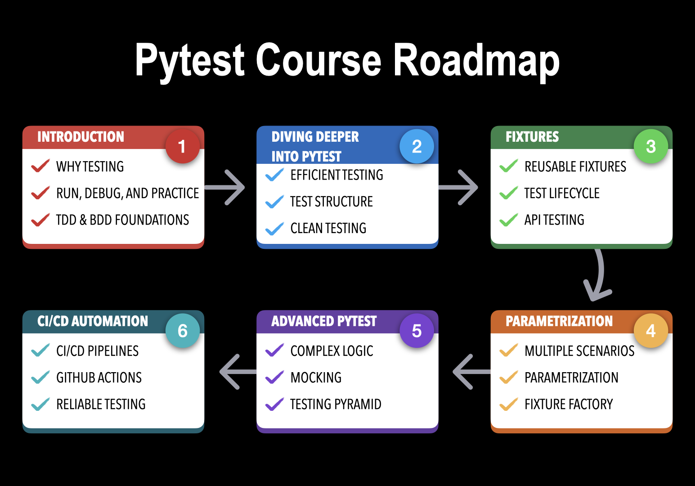

Level up your Python coding skills with automated testing using pytest framework - from basic software testing to advanced test automation, integrated into CI/CD pipelines running on every code change with GitHub Actions.

# Why?

If you are writing Python code and want more confidence when developing new features, refactoring existing code, or deploying your Python application, you need good tests.

Most developers eventually reach the same point. The project grows. Features accumulate. Small changes start breaking unrelated parts of the system. You hesitate before refactoring. You rely on manual checks. You know you need tests, but you are not fully sure where to start or how to structure them properly.

This is exactly where python testing, unit testing, and integration testing become essential parts of modern python programming practices. With a solid test framework, developers can introduce reliable automation testing and avoid fragile manual checks.

Another problem that I see all the time when talking to dev teams is that TDD (Test Driven Development) feels impractical and too slow if used incorrectly. Legacy code is already in production. Thousands of lines of code have been written without tests, and testing every line of existing code is absolute overkill. You know you need some approach to take control of your code efficiently without falling into perfectionism.

This course shows how TDD Test Driven Development and modern automation with Python can be applied pragmatically in real projects without slowing down development.

# About this course

This course is a practical guide to pytest and to building a sustainable approach to basic software testing, test automation, and scalable automation testing in real Python projects.

At the core of the course is pytest. Not just how to write a few tests, but how to use the pytest framework as the fundamental test framework that scales with your codebase.

Step by step, we explore why testing matters, how bugs appear in real code, and how pytest helps you catch them early with fast and simple feedback.

In this course, we focus on writing high-quality tests the right way, without overthinking, and automating testing in CI/CD pipelines using GitHub Actions. This allows your automation testing pipeline to run on every commit, bringing the benefits of modern DevOps workflows to your Python projects.

This course is very practical. My goal is to give you a solid foundation in pytest, python automation, and all the important pytest framework features so you can use them with confidence in real python coding projects.

We will work with real examples, NOT just small toy code. You will practice python API testing, integration testing, and unit testing in realistic scenarios. We will test functions and classes, practice FastAPI testing, and test code with multiple dependencies. You will see how pytest fits different types of projects and how it helps you stay confident as your code becomes more complex.

# Course Roadmap

This course is organized into six modules, each building on the previous one to guide you from basic software testing concepts to advanced test automation and automation testing with pytest, including full integration into CI/CD pipelines.

- In "**Module 1: Introduction**" we cover the fundamentals of basic software testing, see practical examples and the benefits of test automation. We also discuss how to install pytest and write your first tests using the pytest framework. Then we move from theory to practice: understanding TDD (Test Driven Development) and BDD (Behavior-Driven Development) helps us understand why every Python project benefits from automated tests.

- In "**Module 2: Diving Deeper into pytest**" we learn how to write tests effectively. You will write more tests for real-world examples and improve your python testing workflow. To do this, we need to better organize our tests inside a scalable test framework. We will also see how to avoid typical mistakes when starting with automation testing.

- In "**Module 3: Fixtures**" we start diving deeper into pytest features. When you write more tests, repetitive setup patterns appear naturally. In this part we will learn how to create reusable fixtures for data, configuration, and environment setup. Understanding fixture scopes helps you build scalable test automation systems. We will practice FastAPI testing and see how it fits into python API testing workflows.

- In "**Module 4: Parametrization**" we learn more about scalable automation testing. Writing one test that covers multiple inputs, edge cases, and scenarios is essential for efficient test automation. You will learn both basic and advanced parametrization patterns in pytest that improve clarity and maintainability.

- In "**Module 5: Advanced pytest**" we dive deeper into advanced pytest framework features. Complex logic and unpredictable dependencies make writing tests challenging - and that’s where mocking becomes essential. You will also learn about markers, configuration files, code coverage, and the testing pyramid to build scalable automation testing strategies.

- In "Module 6: CI/CD Automation" we focus on test automation at scale. You will learn how the CI/CD cycle works in Python projects and how to integrate pytest into an automated CI/CD pipeline using GitHub Actions. Every code change triggers automated tests, enabling reliable automation testing in modern development teams.

All these topics are taught in detail with the essential theory, but most importantly with many practical demos and real-world python coding examples.

After completing the course, you won’t "just know pytest" - you’ll be able to apply the pytest framework confidently in your daily work, implement unit testing and integration testing, build scalable test automation, and integrate automation testing into CI/CD pipelines for any Python project where clean, reliable, and maintainable code matters.